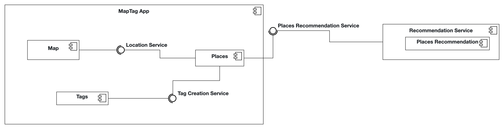

# MapTag iOS-App

## Ekaterina Pavliuchuk & Mikhail Khinevich

## Local development
Use XcodeGen to manage your Xcode Project. 

**What is XcodeGen?** XcodeGen is a tool that automatically generates Xcode project files from a simple configuration file. Instead of manually managing complex Xcode project settings, you define your project structure in the provided `project.yml` file, and XcodeGen creates the `.xcodeproj` file for you. This makes it easier to manage your Xcode project under version control (git), and resolve any merge conflicts that arise.

**Why do we need this?** When you clone this repository, you won't find a ready-to-use `.xcodeproj` file, which you can directly open with Xcode. Instead, you'll find a `project.yml` configuration file that describes how the Xcode project should be set up. You need to generate the actual Xcode project file before you can open and work on the app in Xcode.

1. Install xcodegen
    ```bash
    brew install xcodegen
    ```
2. Generate .xcodeproj
    ```bash
    xcodegen generate
    ```
    
    After running this command, you'll see a new `.xcodeproj` file appear in your project folder. You can then double-click this file to open your project in Xcode.

Since the `xcodegen generate` command must be run when the project is cloned and whenever changes affect the project structure, you can enable Git hooks to run the command automatically after merges and pulls.

Run the following command to point `git` to the hooks:
```bash
git config core.hooksPath .githooks
```

## Project Documentation

This README serves as your primary documentation.

### Problem Statement

Deciding where to eat or what to see in a city is often overwhelming due to endless options and generic online reviews. When faced with this choice, people naturally seek authentic recommendations from a trusted source: their friends. However, the information is often just lost inside  text messages and verbal conversations. As a result, it becomes disorganized, lacks geographical context, and is ultimately lost over time. There is no dedicated, private space for friends to build a collective map of their experiences, leaving a gap for a tool that prioritizes trusted, personal feedback over anonymous, public ratings.
MapTag will be a mobile application designed to solve this problem by providing a private, shared map for friends. The app will allow users to connect with their friends and view a map populated exclusively with their social circle's "tags"—markers representing feelings, memories,and comments for specific city locations. Users can instantly add their own tags, consisting of a location pin, a short text note, and an emotion category. By doing so, MapTag transforms a standard functional map into a unique and private social space that deepens the connection between friends and their city.

### Requirements

#### Functional Requirements (User Stories)

As a new user, I want to create a simple profile so that my friends can identify me and my tags.
As a user, I want to be able to add friends to my network (by searching for their username) so that I can see their tags on my map and they can see mine.
As a user, I want to view a list of my friends so I know who is in my network.
As a user, I want to see a map that shows emotionally-colored markers from my friends so that I can discover places through their experience.
As a user, I want to tap on a friend's marker to read the specific thought or feeling they left so that I can understand the story behind that location.
As a user, I want to be able to add my own emotional tag (a pin, a short note, and an emotion category) to the map so that I can write a feedback or share a personal moment with my friends.


#### Quality Attributes & External Constraints

* **Human Interface Guidelines (HIG) Usability:**  (https://developer.apple.com/design/human-interface-guidelines) The app follows Apple's Human Interface Guidelines by utilizing standard SwiftUI components and navigation patterns. For instance, it employs a TabView for main app navigation and NavigationStack for hierarchical content, as seen in MapTag/MainTabView.swift. Standard controls like Button, TextField, and List are used throughout the app in files like MapTag/Friends/FriendsView.swift and MapTag/Profile/ProfileView.swift to provide a familiar user experience. The app also provides clear visual feedback, such as the custom "glass effect" on buttons in MapTag/Map/MapView.swift, and requests necessary permissions with a clear explanation in MapTag/Supporting/Info.plist.

* **Dark Mode Support:**  The app supports dark mode by using adaptive UI elements. To ensure a consistent and legible appearance, specific views like MapTag/Friends/FriendsView.swift and MapTag/Profile/ProfileView.swift explicitly set a dark color scheme for the navigation bar using the .toolbarColorScheme(.dark, for: .navigationBar) modifier.

* **Responsiveness:**  The user interface is built with SwiftUI, ensuring responsiveness across different screen sizes. The use of stacks (VStack, HStack) and adaptive layouts, as seen in MapTag/ WelcomeView.swift and MapTag/Map/FriendTagDetailView.swift, allows the UI to adjust to various device orientations and dimensions.

* **Persistence:**  The app use SwiftData for data persistence. User information is stored using the UserModel, and user-created placemarks are stored with the MTPlacemark model. The app uses the @Query property wrapper to fetch data and the modelContext to insert, save, and delete it, as demonstrated in the saveUserChanges() function in MapTag/Profile/ProfileContainerView.swift and the saveTag() and deleteTag() functions in MapTag/Map/TagCreationContainerView.swift.

* **Error Handling:**  The app demonstrates error handling, particularly for network requests. In MapTag/ApiView.swift, the loadPlaces() function uses a do-catch block to handle potential errors during API calls. If an error occurs, an alert is presented to the user with options to retry the request or cancel the operation.

* **Performance:** The app uses efficient SwiftUI patterns including `@Query` for data fetching, and proper state management with `@State` and `@Observable`. The map interface uses `MapReader` for efficient gesture handling and `ForEach` with proper identifiers for list performance. Supporting evidence: `MapView.swift`, `FriendsView.swift`, `LocationManager.swift` (lines 5-6).

* **Architecture:**  The application's architecture is organized using the container-presentational pattern. This design pattern separates views into two distinct types: container views that manage logic and state, and presentational views that are responsible for the UI. Container views fetch data, handle user input, and pass the necessary data and callbacks to their corresponding presentational views. This separation improves reusability, testability, and maintainability of the code.

#### Glossary (Abbott’s Technique)


| Tag  | The core unit of user-generated content on MapTag. A Tag consists of three components: a specific geographical location (the pin), a short text note (the user's thought, memory, or comment), and a pre-defined Emotion Category. |
| User Profile | A user's personal identity within the MapTag app. It contains essential information, such as a unique username, used for identification, searching for, and adding friends to one's network. |
| Username | A unique identifier chosen by a user for their profile. It is the primary method for searching for and adding friends to a user's network. |
| Friend List | A dedicated screen or section within the app that displays all the users currently in one's Friend Network. |
| Shared Map | The central interface of the MapTag application. Unlike a standard public map, this map is a private, personalized view populated exclusively with Tags created by the user and their approved friend network.|
| Privacy | A foundational principle of MapTag where all user-generated content (Tags, profiles, friend networks) is visible only to the user and their approved friends. |

#### Analysis Object Model

Inserting an image in Markdown:


### Architecture



#### Subsystem Decomposition

Subsystem MapTag App -  main user-facing application installed on the user's device. Its primary responsibilities are to render the user interface, manage user interactions, handle local data, and communicate with external services.

Component Map - is responsible for displaying the interactive map, managing camera position, and showing the user's current location. Used as main View of the App, stores the Tags, provides Connection to the API and shows the Fetched by Recommendation Service results.

Component Places -  responsibility is to display lists or collections of places, also fetch data from external service for recommendations.

Component Tags - handles the creation, management, and display of user-generated tags that are likely associated with locations on the map. Stors the tagName, tagNote and emojiType.

Subsystem Recommendation Service - represents an API Call to fetch the place recommendations

---
