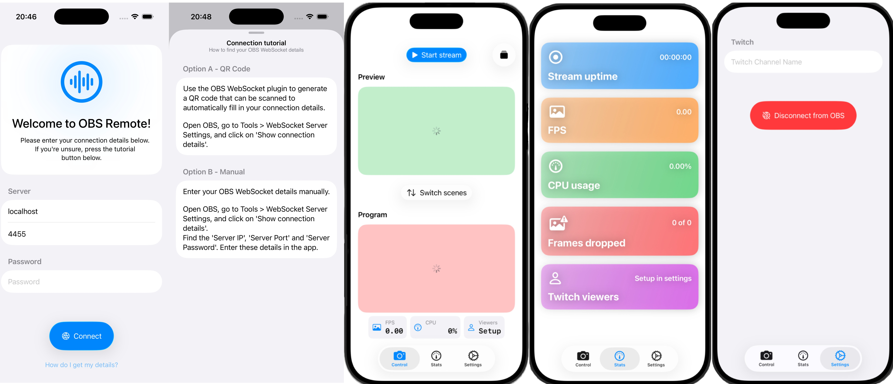
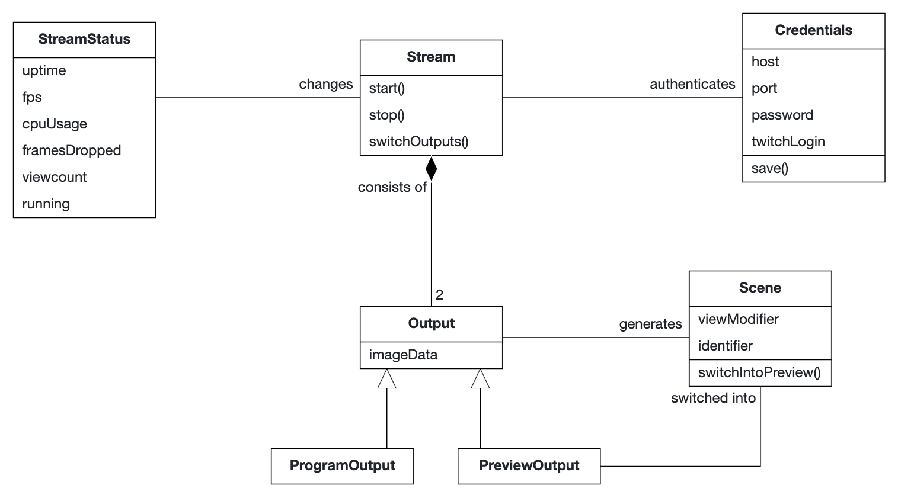
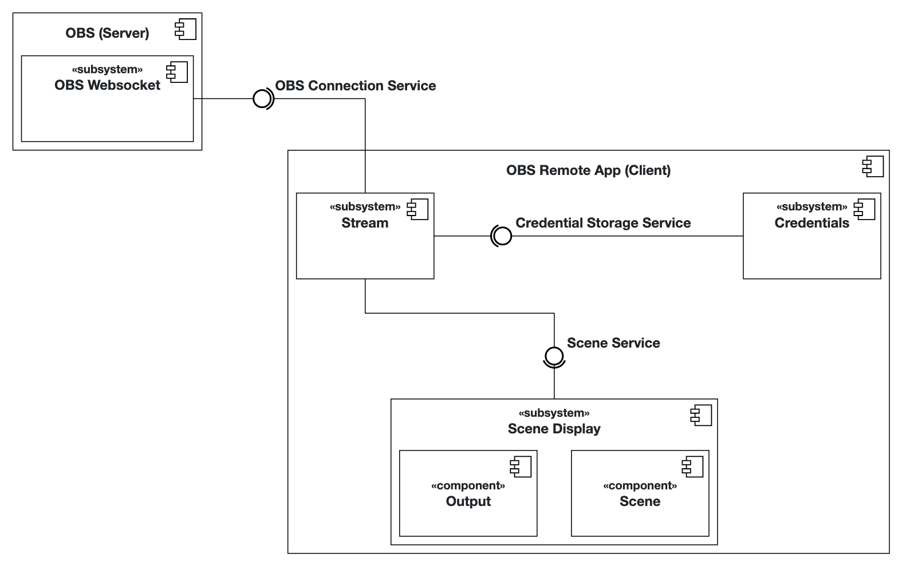

# OBS Remote iOS-App

## Valentin Lehnmann & Mikhail Khinevich

## Local development
Use XcodeGen to manage your Xcode Project.

**What is XcodeGen?** XcodeGen is a tool that automatically generates Xcode project files from a simple configuration file. Instead of manually managing complex Xcode project settings, you define your project structure in the provided `project.yml` file, and XcodeGen creates the `.xcodeproj` file for you. This makes it easier to manage your Xcode project under version control (git), and resolve any merge conflicts that arise.

**Why do we need this?** When you clone this repository, you won't find a ready-to-use `.xcodeproj` file, which you can directly open with Xcode. Instead, you'll find a `project.yml` configuration file that describes how the Xcode project should be set up. You need to generate the actual Xcode project file before you can open and work on the app in Xcode.

1. Install xcodegen
    ```bash
    brew install xcodegen
    ```
2. Generate .xcodeproj
    ```bash
    xcodegen generate
    ```
    
    After running this command, you'll see a new `.xcodeproj` file appear in your project folder. You can then double-click this file to open your project in Xcode.

Since the `xcodegen generate` command must be run when the project is cloned and whenever changes affect the project structure, you can enable Git hooks to run the command automatically after merges and pulls.

Run the following command to point `git` to the hooks:
```bash
git config core.hooksPath .githooks
```

## Project Documentation

This README serves as your primary documentation. 

### Problem Statement

The app targets live streamers who want to control their stream without touching the PC running it. Mainly this includes people doing IRL streams (IRL stands for „In Real Life“, i.e. walking around with a camera in their hand) who often use their home PC to run the stream and broadcast the signal to Twitch or YouTube. This means they have no physical access to the computer during the stream and need a way to control it remotely.
The app should facilitate remote control of OBS Studio, a widely adopted recording and live streaming software. Users of OBS Studio should be able to connect to their PC running OBS and do everything they need to do during a live stream. This includes switching scenes, seeing preview images and start and stop the livestream.

### Requirements

#### Functional Requirements (User Stories)

As a streamer using OBS I want to…
- be able to connect to OBS running on my PC and authenticate with an optional password so that I can control it afterwards
- be able to save my credentials so I dont have to remember my connection details
- be able to see the current stream status and stats so I can see whether I'm live
- be able to start and stop the stream
- have a list of all my scenes
- switch the preview scene so I can change what my viewers are seeing next
- be able to use the transitions in OBS to cut between the preview and the program scene so I can change the content my viewers are seeing
- be able to see the preview and program output so I can check whether the viewers are seeing the right things

#### Glossary (Abbott’s Technique)

| Terms    | Definition      |
| ------------- | ------------- |
| Credentials | Stores connection details (url, password, Twitch username) |
| StreamStatus | Represents the current info about the stream (uptime, frames per second (FPS), viewcount) |
| Stream | Represents the stream itself, can be started and stopped |
| Scene | Holds information about a scene (name, identifier) and can be switched into preview |
| Transition | Represents a transition in OBS (e.g. cut or fade) and can be used to switch preview with program |
| Output | Holds a current screenshot of either the preview or the program feed |

#### Analysis Object Model



### Architecture

#### Subsystem Decomposition



- OBS - external software that this app connects to and controls
- Stream - manages the connection to OBS and provides methods to start and stop the stream
- Scene Display - shows the scenes and allows switching between them
    - Scene - represents a scene in OBS
    - Output - holds a screenshot of either the preview or program output
- Credentials - manages saving and loading connection details
