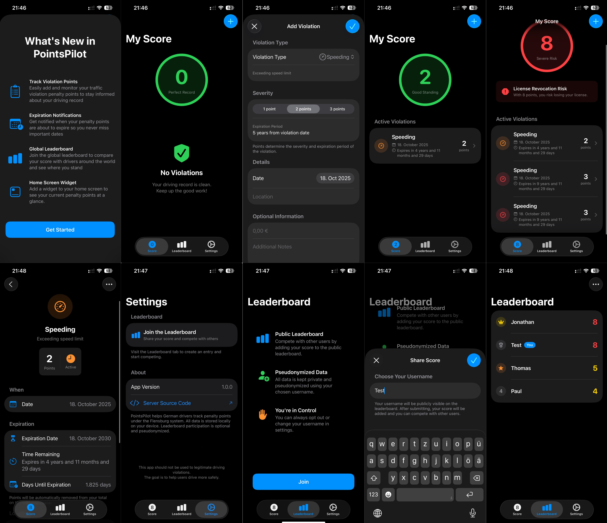

# PointsPilot - Traffic Penalty Points Tracker, iOS-App

## Jonathan Thorsten Müller & Mikhail Khinevich
PointsPilot helps drivers in Germany track their traffic penalty points under
the Flensburg system. It provides a user-friendly interface to log violations,
view current points, check expirations, and optionally share scores on a global
leaderboard.

For the leaderboard-feature, a custom REST API server is created. This server-side code is using Vapor and  available at
[https://gitlab.lrz.de/jnthnmllr/pointspilotserver](https://gitlab.lrz.de/jnthnmllr/pointspilotserver).

## Local development

Use XcodeGen to manage your Xcode Project.

**What is XcodeGen?** XcodeGen is a tool that automatically generates Xcode project files from a simple configuration file. Instead of manually managing complex Xcode project settings, you define your project structure in the provided `project.yml` file, and XcodeGen creates the `.xcodeproj` file for you. This makes it easier to manage your Xcode project under version control (git), and resolve any merge conflicts that arise.

**Why do we need this?** When you clone this repository, you won't find a ready-to-use `.xcodeproj` file, which you can directly open with Xcode. Instead, you'll find a `project.yml` configuration file that describes how the Xcode project should be set up. You need to generate the actual Xcode project file before you can open and work on the app in Xcode.

1. Install xcodegen
   ```bash
   brew install xcodegen
   ```
2. Generate .xcodeproj

   ```bash
   xcodegen generate
   ```

   After running this command, you'll see a new `.xcodeproj` file appear in your project folder. You can then double-click this file to open your project in Xcode.

Since the `xcodegen generate` command must be run when the project is cloned and whenever changes affect the project structure, you can enable Git hooks to run the command automatically after merges and pulls.

Run the following command to point `git` to the hooks:

```bash
git config core.hooksPath .githooks
```

## Project Documentation

This README serves as your primary documentation.

### Problem Statement

Many German drivers must track penalty points under the Flensburg system, but the current manual approach—remembering individual infractions, point values, and expiration dates—makes it hard to maintain an accurate, up-to-date overview. This lack of visibility can lead to unexpected consequences: reaching key thresholds (e.g., 8 points → mandatory courses, 14 points → license revocation) without prior warning. The problem affects all licensed drivers in Germany, especially frequent drivers and delivery professionals whose livelihood depends on keeping a valid license.

This app provides a private, user-friendly solution: digital record-keeping for violations, automatic calculation of total points and nearest expiration dates, threshold warnings and the ability to edit or remove entries. In addition, users may opt in to share their current score to a global leaderboard for comparison with others. The participation is voluntary and under a user-chosen pseudonym. The entry is revocable at any time. Furthermore, by delivering clear visibility into point accumulation and expiry, the app helps drivers make informed decisions, adopt safer driving behavior, and avoid disruptive license-related consequences.

### Requirements

#### Functional Requirements (User Stories)

- As a driver, I want to record my traffic violations with details (date, location, violation type, points) so that I can maintain an accurate personal log of my infractions.

- As a driver, I want to view my current total penalty points so that I understand my current legal standing.

- As a driver, I want to see when my oldest points will expire so that I can anticipate when my point total will decrease.

- As a driver, I want to receive a visual hint when I approach warning thresholds (4, 6, 8 points) so that I can modify my driving behavior before reaching critical levels.

- As a driver, I want to edit or delete violation entries so that I can correct mistakes or remove duplicate records.

- As a driver, I want to be able to publish my score to participate in a global leaderboard so that I can compare my driving behavior with others.

#### Quality Attributes & External Constraints

- **Human Interface Guidelines (HIG) Compliance:** The app strictly follows
  Apple's Human Interface Guidelines across app icons, colors, icons, and
  toolbars. The design prioritizes simplicity, consistency, and accessibility,
  using only SF Symbols for icons, a minimal color palette with semantic
  meaning, and properly structured toolbars. Detailed documentation of HIG
  compliance is available in [HIG_COMPLIANCE.md](./docs/HIG_COMPLIANCE.md).
- **Dark Mode Support:** The app fully supports Dark Mode by sticking to system
  colors and avoid hardcoded colors or custom crafted UI elements.
- **One dynamic element:** For displaying the active and expired penalty points,
  the app uses a dynamic List view.
- **SwiftData:** The app uses SwiftData for local data persistence of
  penalty points and user profiles.
- **Container Presentational Pattern:** The app fully embraces the Container
  Presentational pattern, separating business logic from UI code. Presentational
  views and container views are clearly distinguished and accordingly named and
  organized in the project structure. Hence all presentational views get the
  data via props and do not contain any business logic.
- **Observable class:** The leaderboard is managed by an observable class that
  is used to store the leaderboard entries and display them in the leaderboard
  view. The user can edit his username or amount of points to trigger a direct
  UI change.
- **API calls:** For the leaderboard feature, the app uses a custom REST API
  built with Vapor. For that purpose, the app implements API calls necessary to
  provide the leaderboard functionality.
- **Handling of Network Errors:** The app implements the handling of network
  errors by displaying them as a view or an alert to the user.
- **Third-party packages:** The first time the app is launched, it uses the
  [WhatsNewKit](https://github.com/SvenTiigi/WhatsNewKit) package to display
  a "What's New" screen to inform users about new features and changes.
- **Logging:** Throughout the app, I used Apple's logger to log important
  events, as well as errors. The logs are categorized by different subsystems,
  like main, networking, or data.
- **Coding Style:** Throughout the codebase, I sticked to the [Swift API Design
  Guidelines](https://www.swift.org/documentation/api-design-guidelines/). Apart
  from that, I fully documented all classes and structs and ensured the absence
  of SwiftLint errors and warnings.

#### Glossary (Abbott’s Technique)

| Term                    | Definition                                                                                          |
| ----------------------- | --------------------------------------------------------------------------------------------------- |
| Driver                  | The end user who records and monitors their traffic penalty points.                                 |
| Flensburg System        | German point system tracking traffic violations centrally; used for thresholds and license actions. |
| Traffic Violation       | A legally defined infraction committed by the driver (e.g., speeding, red light).                   |
| Violation Entry         | One recorded instance of a traffic violation stored in the app with its attributes.                 |
| Violation Type          | Categorical classification of a violation (speeding, phone use, etc.).                              |
| Points (Traffic Points) | Numerical penalty assigned to a violation under the Flensburg system.                               |
| Point Total             | The current sum of all non‑expired points across violation entries.                                 |
| Expiration Date         | The date on which the points of a violation entry are removed from the point total per legal rules. |
| Expired Points          | Points whose expiration date has passed and no longer contribute to the point total.                |
| Threshold               | A significant cumulative point level with legal or warning relevance (e.g., 4, 8, 12, 14).          |
| Warning Threshold       | A predefined threshold at which the app notifies the driver to promote corrective behavior.         |
| Leaderboard             | Aggregated list comparing published scores of participating drivers.                                |
| Username                | User‑chosen public identifier used instead of real name on the leaderboard.                         |

#### Analysis Object Model


### Architecture

#### Subsystem Decomposition


Description of Subsystems:

**1. PointsPilot App (Main Subsystem)**

- **Responsibilities:** Provides the iOS user interface and coordinates all client-side functionality for managing penalty points and leaderboard participation.
- **Key Components:**
  - **Leaderboard Component:** Manages the global leaderboard of participating users and their scores.
  - **PenaltyPoints Component:** Manages the display and interaction with traffic violation entries, including adding, editing, and viewing penalty points.
  - **User Component:** Handles user profile management and settings, including username selection for leaderboard participation.

**2. Service Layer**

- **Responsibilities:** Mediates communication between different subsystems.
- **Key Services:**
  - **Leaderboard Service:** Manages API calls for fetching leaderboard data and
    publishing user scores to the global leaderboard.
  - **Internal Leaderboard Service:** Handles CRUD operations on leaderboard entries, including fetching rankings and submitting scores.
  - **PenaltyPoints Service:** Handles CRUD operations for violation entries, including calculation of point totals and expiration tracking.
  - **User Service:** Handles synchronization of user data and username management.

**3. Public-API-Server (External Subsystem)**

- **Responsibilities:** Provides REST API endpoints for data persistence, leaderboard aggregation, and user management.
- **Key Components:**
  - **Leaderboard Details:** Backend component managing leaderboard data storage and retrieval.
  - **User Details:** Backend component handling user profile data.

---
