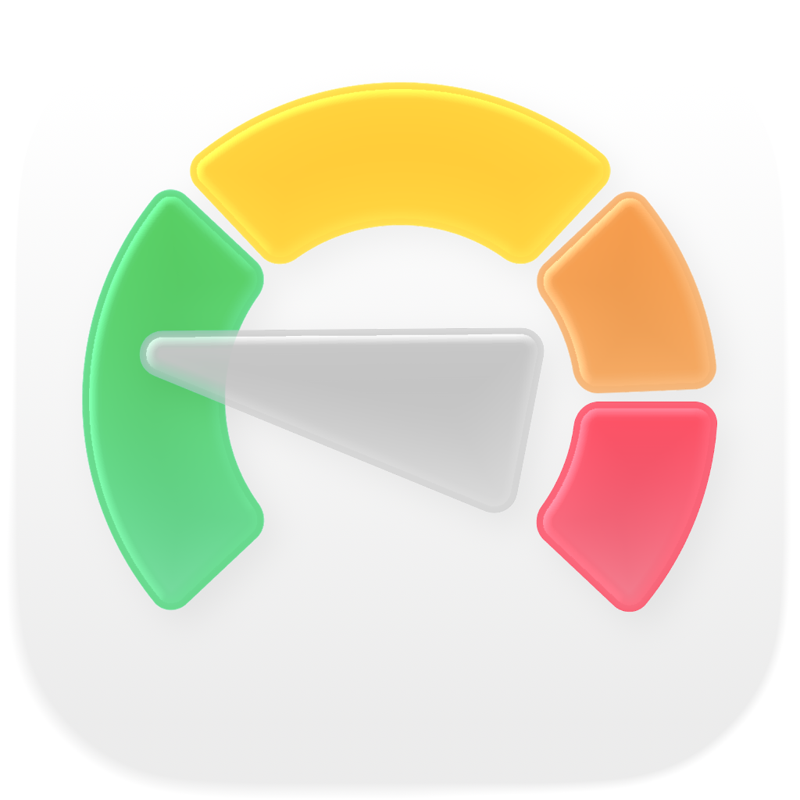
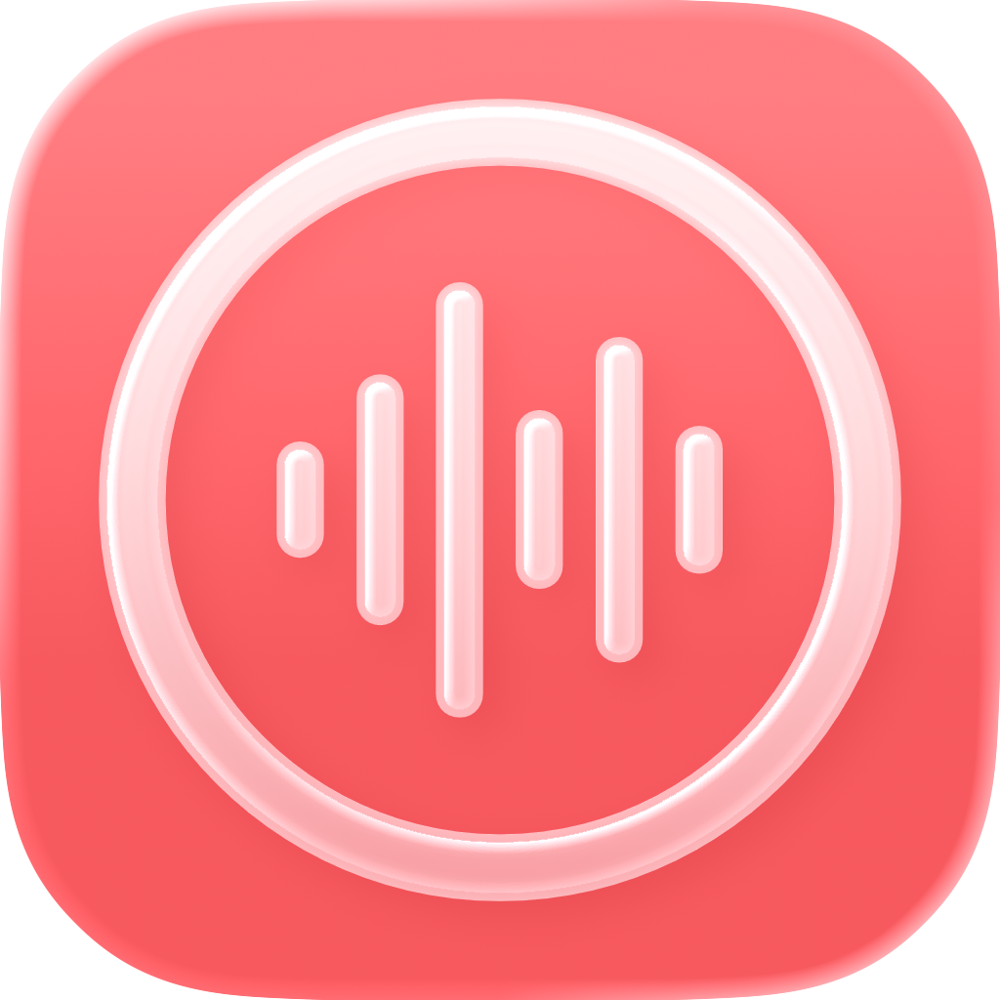
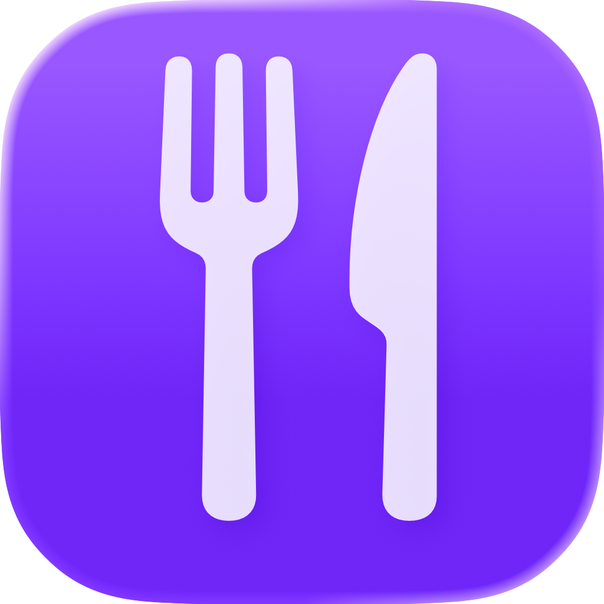
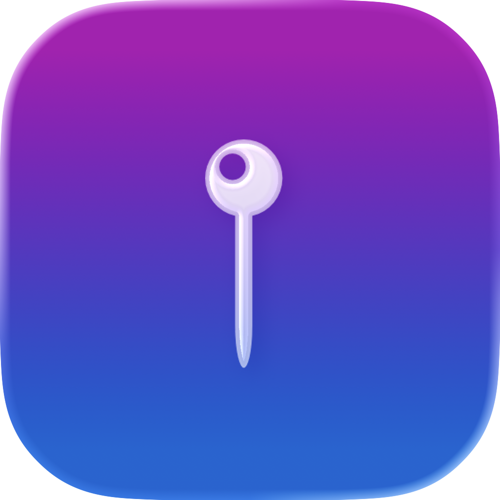

# SwiftUI Collaboration Apps

This repository showcases iOS applications developed as part of a [Technical University of Munich](https://www.tum.de/) [iPraktikum-Course](https://aet.cit.tum.de/projects/courses/ipraktikum/) on Swift and iOS development. As the course instructor, I guided students through intensive one-week development sprint, where each Student built a complete iOS application from concept to implementation.

**My Role:**
- **Technical Mentorship** - Provided hands-on guidance in Swift, SwiftUI, and iOS development best practices
- **Pair Programming** - Worked directly with students through their code reviews and collaborative-teaching coding sessions
- **Architecture & Design** - Advised on app architecture, data flow, functionality, and code quality improvements
- **Problem Solving** - Helped students overcome technical challenges and make critical design decisions

Each project represents a collaborative effort between student and myself, demonstrating real-world software development practices.
### Source Code for each App is stored in private repositories

## Radio Atlas iOS-App ["Best Coursewide iOS App" Nomination Winner]

RadioAtlas is an iOS app for discovering and streaming global radio stations through an interactive map interface. Built with SwiftUI and SwiftData, it provides seamless access to thousands of stations from the Radio Browser API with offline favorites support.

## Points Pilot iOS-App

PointsPilot helps drivers in Germany track their traffic penalty points under
the Flensburg system. It provides a user-friendly interface to log violations,
view current points, check expirations, and optionally share scores on a global
leaderboard.

## OBS Remote iOS-App

OBS Remote is an iOS app that allows live streamers to remotely control OBS Studio (broadcasting software) from their iPhone. The app is designed for:
- Remote OBS control - Connect to OBS Studio running on a PC and control it wirelessly
- Stream management - Start and stop live streams remotely
- Scene switching - View all available scenes and switch between preview and program scenes
- Live monitoring - See real-time stream status, stats (uptime, FPS), and viewer count
- Visual preview - View preview and program output screenshots to verify what viewers are seeing
- Credential storage - Save connection details (URL, password, Twitch username) for quick access

The app primarily targets IRL streamers (In Real Life streamers) who stream while away from their computer and need to control their broadcast remotely without physical access to the PC running OBS Studio.

## Recipe Planner iOS-App

Recipe Planner is an iOS app that helps users organize their meals and maintain healthy eating habits. The app allows users to:
- Collect and manage recipes - Store personal recipes with ingredients, instructions, images, and tags for easy organization
- Search online recipes - Find and import recipes from the internet using the Spoonacular API
- Plan meals - Assign recipes to specific days and times in a weekly meal planner
- Track nutrition - View daily health scores based on personalized calorie and nutrition recommendations (calculated from user's age and weight)
- Monitor dietary goals - See nutritional breakdowns (calories, protein, carbohydrates, fat) for planned meals

The app solves the common problem of daily meal planning in busy lifestyles by combining recipe management, meal scheduling, and health tracking in one place.

## MapTag iOS-App

MapTag is a private, social mapping iOS app that helps friends share and discover places through personal recommendations and experiences. The app allows users to:
- Create emotional location tags - Drop pins on a map with short notes and emotion categories to share feelings, memories, or comments about specific places
- Build a friend network - Connect with friends by searching usernames to create a trusted, private social circle
- View a shared map - See a personalized map populated exclusively with tags from friends (not public reviews)
- Discover authentic recommendations - Tap markers to read friends' thoughts and experiences about restaurants, attractions, and other city locations
- Maintain privacy - All content (tags, profiles, networks) is visible only to approved friends, not the general public

The app solves the problem of lost recommendations that typically disappear in text messages or conversations by creating a dedicated, private space where friends can collectively build a map of their experiences with geographical context and emotional connection.

## TipUp iOS-App

TipUp is an iOS app that helps restaurant groups calculate and distribute tips fairly among everyone based on what each person ordered. The app allows users to:
- Calculate fair tips - Automatically compute how much each person should tip based on their individual food costs
- Manage friend groups - Create and maintain lists of friends to use with any dining group
- Track individual orders - Record the price each person paid for their food to ensure proportional tip distribution
- Customize tip percentage - Choose the tip percentage to control how much the group pays
- Multi-currency support - Calculate tips in different currencies using real-time exchange rates
- View dining history - Access previous dining sessions and tip calculations

The app solves the common problem of confusing tip calculations when dining in groups by ensuring everyone contributes a fair amount based on what they actually ordered, preventing disagreements and calculation mistakes.

