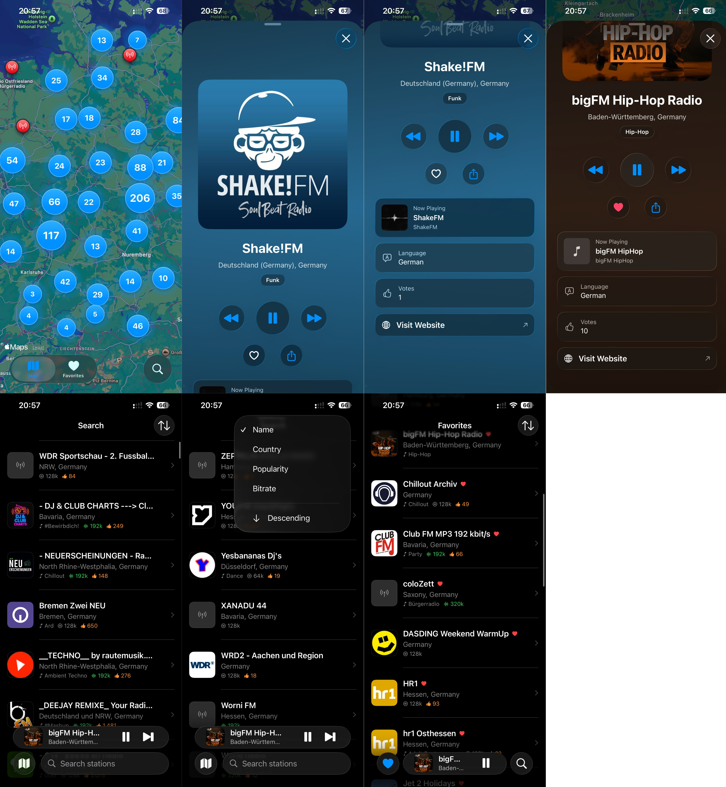
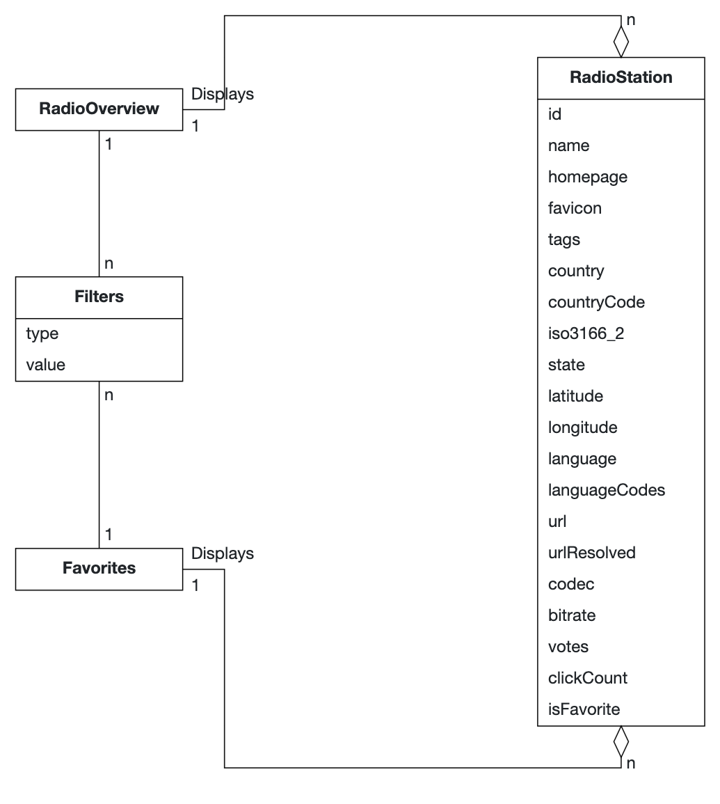
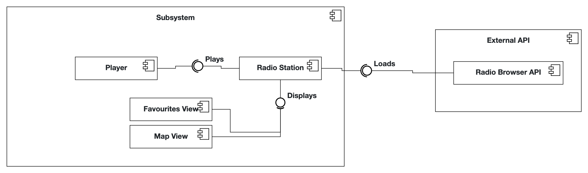

# RadioAtls iOS-App

## Project Documentation

This README serves as your primary documentation.

### Introduction

RadioAtlas is an iOS app for discovering and streaming global radio stations through an interactive map interface. Built with SwiftUI and SwiftData, it provides seamless access to thousands of stations from the Radio Browser API with offline favorites support.

### App Purpose

RadioAtlas solves the problem of radio discovery by providing a geographical, visual approach to finding stations worldwide. Users can explore stations by location, genre, and language—making cultural exchange and musical discovery intuitive and engaging.

### Problem Statement

In an era of algorithm-driven music streaming and homogenized content, radio remains a powerful medium for discovering authentic cultural experiences, local programming, and diverse musical genres. However, accessing radio content beyond one's immediate geographical area presents significant challenges. Traditional radio apps either focus exclusively on mainstream commercial stations, require expensive subscriptions, or provide limited discovery mechanisms that fail to leverage the geographical and cultural richness of global radio broadcasting.

Music enthusiasts, language learners, cultural explorers, and travelers face fragmentation when trying to discover radio stations that match their interests. Existing solutions lack the intuitive geographical context that makes radio discovery meaningful—users cannot easily visualize where stations are located, explore regional music scenes, or understand the cultural diversity available through internet radio. This creates barriers to cultural exchange and limits exposure to independent, community-driven broadcasting that enriches the global media landscape.

### Requirements

#### Functional Requirements (User Stories)

- **As a music enthusiast**, I want to browse radio stations on an interactive map so that I can discover stations from different countries and regions visually.
- **As a radio listener**, I want to search and filter stations by genre, country, or language so that I can quickly find content that matches my interests.
- **As a user**, I want to play radio stations directly in the app with simple controls so that I can listen to content without leaving the application.
- **As a regular listener**, I want to save my favorite radio stations so that I can quickly access them without searching each time.
- **As a mobile user**, I want clear error messages when stations fail to load or play so that I understand what went wrong and can take appropriate action.

## Quality Attributes & External Constraints

### Design Guidelines Compliance

RadioAtlas adheres to Apple's Human Interface Guidelines and Design Do's & Don'ts across all features.

#### Navigation & Information Architecture
Following [Navigation Design for iOS](https://developer.apple.com/design/human-interface-guidelines/navigation-and-search), the app implements flat navigation via TabView with 3 tabs, ensuring users always know their location and can reach content with minimal taps. The persistent mini player uses iOS 26's `.tabViewBottomAccessory()` API to remain accessible across all tabs without disrupting the navigation hierarchy.

**HIG Reference:** [Tab Bars Guidelines](https://developer.apple.com/design/human-interface-guidelines/tab-bars) — "Use between three and five tabs on iPhone".

#### Visual Design & Dark Mode
Semantic color system (`.primary`, `.secondary`, AccentColor) ensures automatic adaptation between light and dark appearances. Now Playing view forces `.preferredColorScheme(.dark)` for consistent audio playback theming, reducing eye strain during extended listening sessions—a core Dark Mode benefit.

**HIG Reference:** [Dark Mode Guidelines](https://developer.apple.com/design/human-interface-guidelines/dark-mode) — "Test content to ensure legibility in both modes".

#### Accessibility
VoiceOver compatibility implemented with `.accessibilityLabel()`, `.accessibilityHint()`, and `.accessibilityValue()` modifiers on all interactive controls. Dynamic Type support via semantic font styles ensures text scales with user preferences. All tap targets meet the 44×44pt minimum per Apple's design standards.

**HIG Reference:** [VoiceOver Guidelines](https://developer.apple.com/design/human-interface-guidelines/voiceover) — "VoiceOver should speak the type of element in addition to the label".

**Design Do's & Don'ts Reference:** [UI Design Tips](https://developer.apple.com/design/tips/) — "Create a layout that fits the screen" and "Use simple, direct labels".

##### Error Handling & Logging
15-second playback timeout with toast notifications. OSLog with categorized subsystems (Network, Player, Database, UI).

##### Background Playback
Continuous audio when backgrounded/locked via `UIBackgroundModes`. MPNowPlayingInfoCenter for lock screen controls.

##### Dependencies
FRadioPlayer, ClusterMap, Kingfisher, UIImageColors, swiftui-toasts, TouchVisualizer.

#### Glossary (Abbott’s Technique)
| Term | Definition |
| --- | --- |
| **Radio Station** | A broadcast source with a unique ID, name, stream URL, metadata (genre, language, country), and status (online/offline). Primary entity presented on the map and in lists. |
| **Station ID** | Stable identifier used to reference a Radio Station across network, persistence, and UI layers. |
| **Stream URL** | The HTTP(s) endpoint used by the Player to fetch audio data for a station. |
| **Station Metadata** | Descriptive fields for a station: name, description, genre(s), language(s), country/region, bitrate, favicon/artwork. |
| **Genre** | A category label (e.g., Jazz, News) assigned to a station; used for filtering and discovery. |
| **Language** | Primary spoken language(s) of a station’s programming; used in filters and accessibility hints. |
| **Country/Region** | Geographical attributes that anchor a station on the map and enable cultural discovery. |
| **GeoLocation** | Latitude/longitude used to place a station on the interactive map. |
| **Map Viewport** | The visible geographic window (center + zoom) used to query and render relevant stations. |
| **Map Marker** | Visual marker representing a single station; selectable to open station details and playback. |
| **Marker Cluster** | Grouped representation of nearby stations to reduce visual clutter at lower zoom levels. |
| **Player** | The audio playback component controlling stream start/stop, buffering, and error reporting. |
| **Playback State** | Finite states for Player: idle → connecting → buffering → playing → paused → failed. |
| **Now Playing** | Currently selected station with live metadata (e.g., song/artist) and elapsed time if available. |
| **Favorites** | User’s persisted collection of stations for quick access; supports add/remove and ordering. |

#### Analysis Object Model

### Architecture

RadioAtlas follows a layered architecture with clear separation of concerns:

**Presentation Layer (UI)**
- SwiftUI views organized by feature: Map, Favorites, Search
- Observable state management with `@Observable` macro (iOS 17+)
- Tab-based navigation with persistent mini player

**State Management**
- `RadioPlayerManager`: Singleton managing playback, metadata, and lock screen integration
- `StationHistoryManager`: Browser-like forward/back navigation through played stations
- `SearchSettings`: Search state and recent searches

**Data Layer**
- SwiftData models for persistence with `RadioStation` as the core entity
- Repository pattern via `StationRepository` for CRUD operations
- Automatic sync with Radio Browser API every 24 hours

**External Integration**
- `RadioBrowserAPI`: REST client with automatic failover across mirror servers
- `FRadioPlayer`: Third-party framework for HTTP streaming
- MediaPlayer framework for lock screen controls

**Key Design Decisions**
1. **SwiftData over Core Data**: Modern Swift-first API reduces boilerplate
2. **Observable instead of ObservableObject**: Better performance, cleaner syntax (iOS 17+)
3. **Eager sync on launch**: Ensures offline functionality by caching stations locally
4. **Single player instance**: `RadioPlayerManager.shared` prevents playback conflicts
5. **Repository pattern**: Abstracts SwiftData operations for testability

#### Subsystem Decomposition

- **Presentation (UI)** — *Map View, Favourites View*  
  - **Does:** render stations, handle user intents.  
  - **In:** `Displays` (read-only `DisplayStation` DTOs).  
  - **Out:** `StationID` selections, favorite toggles, filters.

- **Playback (Player)**  
  - **Does:** start/stop audio, expose status.  
  - **In:** `Playable` → returns `StreamTarget`.  
  - **Out:** `PlaybackState` to UI.

- **Domain / Catalog (Radio Station)**  
  - **Does:** own station models, normalize API data, resolve play targets.  
  - **Provides:** `Displays`, `Playable`.  
  - **In:** `Loads` from External API.  
  - **Out:** `DisplayStation[]`, `StreamTarget`.

- **External Integration (Radio Browser API)**  
  - **Does:** supply station metadata.  
  - **Provides:** `Loads` (queries returning station records).

**Main flows**  
1) UI ← `Displays` from Domain.  
2) UI → `Playable(StationID)` → Player gets `StreamTarget`.  
3) Domain refreshes via `Loads` and republishes `Displays`.

**Key types:** `StationID`, `DisplayStation`, `StreamTarget`, `PlaybackState`.

### Developed by Justin Dennis Lanfermann & Mikhail Khinevich