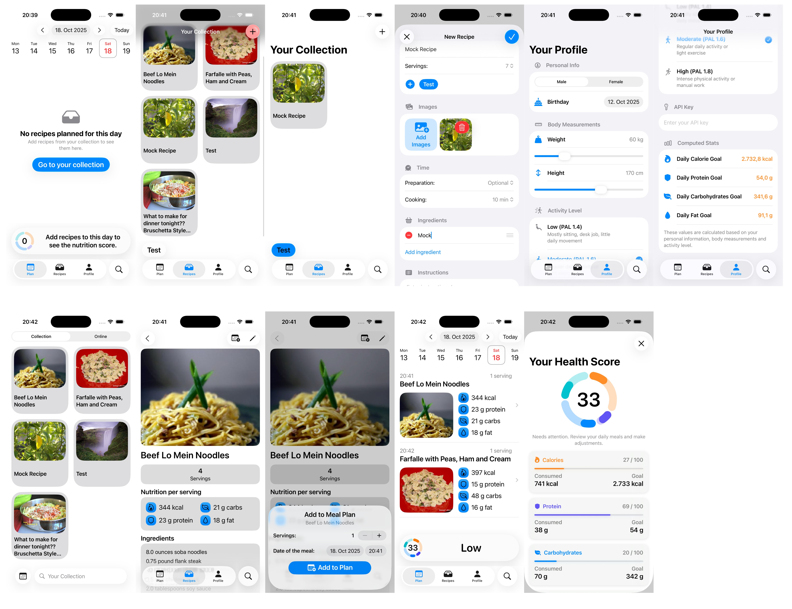
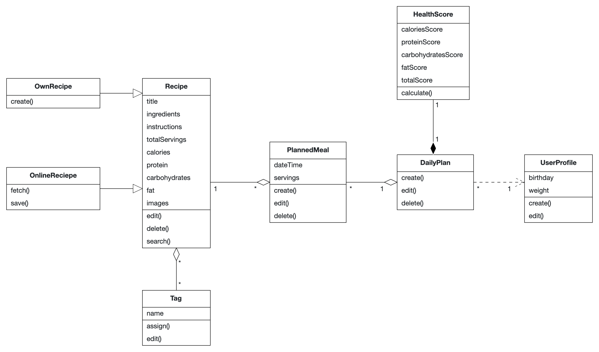
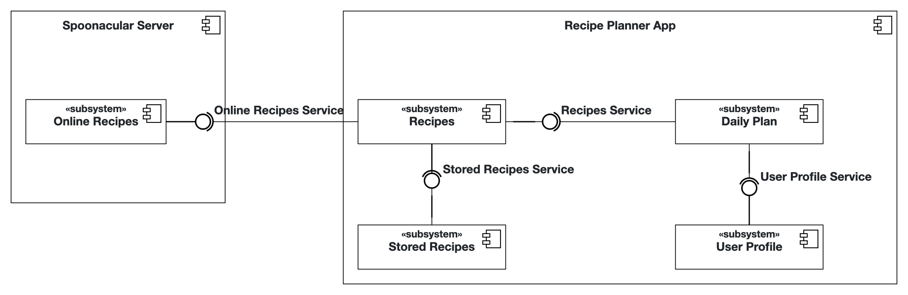

# Recipe Planner iOS-App


## Tom Kuttler & Mikhail Khinevich

## Project Documentation

This README serves as your primary documentation.

### Spoonacular API
The app uses the Spoonacular API to provide online recipe searches.
You can get a free key here: https://spoonacular.com/food-api/console#Dashboard
Paste the key in the Profile Tab of the app.
Note: The free plan is limited to 50 requests / day.

### Problem Statement

Many people struggle to plan their daily meals in their stressful everyday lives.
I often ask myself what I should cook for dinner just before I have to start.

I need an application to store my recipes and assign them to a daily plan. The recipes should contain a list of ingredients, cooking instructions, and images.
Assigning tags to the recipes would help me organize my recipes.

To keep track of my health, the plan view should include a health score for every day that lets me quickly see the nutrition details of the planned meals.
The score should be calculated based on calorie reference values based on the age and weight entered by the user.
Additionally, information on protein, carbohydrates, and fat nutrition should be considered.

The application should allow the manual import of recipes via a form or the searching of online recipes and importing to the collection.

### Requirements

#### Functional Requirements (User Stories)

- As a hobby chef, I want to collect all my recipes in an app so that I can quickly search and view a recipe.
- As a hobby chef, I want to tag my recipes with categories so that I can organize them more efficiently.
- As a hobby chef, I want to assign recipes to a specific day and time in a meal plan so that I always know what to cook for each meal.
- As a hobby chef, I want to see a daily health score based on my plan so that I can understand how nutritious my daily meals are.
- As a hobby chef, I want to see if the planned recipes for a day are healthy so that I can adapt the plan if necessary.
- As a hobby chef, I want to save my own recipes so that I can reference them when cooking easily.
- As a hobby chef, I want to search for online recipes from the internet so that I can get inspiration and cook new meals.
- As a hobby chef, I want to import recipes I find online into my collection so that I can easily save and edit them.
- As a hobby chef, I want to enter my age and weight so that the app can adjust calorie and nutrition recommendations for me.

#### Glossary (Abbott’s Technique)

| Terms    | Definition      |
| ------------- | ------------- |
| Recipe | A record containing the name of a meal, a list of ingredients, cooking instructions, tags, images, nutritional information and the number of total servings. |
| OnlineRecipe | A recipe found through the search feature from the internet. Can be imported into the users collection. |
| NutritionInformation | Data about a recipes nutritional content (calories, protein, carbohydrates and fat) |
| Tag | A label assigned to a recipe to categorize it, e.g. "vegetarian", "lunch", "dinner". |
| MealPlan | A schedule that stores planned recipes. | 
| PlannedRecipe | An association between a recipe, a specific date and time and the count of servings the user wants to eat. |
| HealthScore | A number showing how healthy the planned meals of a day are, based on nutritional information. |
| UserProfile | Information stored about the user (age and weight for health score calculation) |

#### Analysis Object Model



### Architecture

#### Subsystem Decomposition



* Online Recipes:
    - provides searching for online recipes, returns list of recipe summaries
    - provides full online recipe information lookup including nutritional info

* Stored Recipes:
    - stores manually imported recipes from user
    - stores imported recipes from online recipes

* Recipes:
    - provides access to stored and online recipes
    - allows to import and save an online recipe to the collection

* Daily Plan:
    - stores planned meals that assigns a recipe to a day, time and servings count
    - calculates the daily health score

* User Profile:
    - stores birthday to calculate the age and weight info
---
## Local development
Use XcodeGen to manage your Xcode Project. 

**What is XcodeGen?** XcodeGen is a tool that automatically generates Xcode project files from a simple configuration file. Instead of manually managing complex Xcode project settings, you define your project structure in the provided `project.yml` file, and XcodeGen creates the `.xcodeproj` file for you. This makes it easier to manage your Xcode project under version control (git), and resolve any merge conflicts that arise.

**Why do we need this?** When you clone this repository, you won't find a ready-to-use `.xcodeproj` file, which you can directly open with Xcode. Instead, you'll find a `project.yml` configuration file that describes how the Xcode project should be set up. You need to generate the actual Xcode project file before you can open and work on the app in Xcode.

1. Install xcodegen
    ```bash
    brew install xcodegen
    ```
2. Generate .xcodeproj
    ```bash
    xcodegen generate
    ```
    
    After running this command, you'll see a new `.xcodeproj` file appear in your project folder. You can then double-click this file to open your project in Xcode.

Since the `xcodegen generate` command must be run when the project is cloned and whenever changes affect the project structure, you can enable Git hooks to run the command automatically after merges and pulls.

Run the following command to point `git` to the hooks:
```bash
git config core.hooksPath .githooks
```
