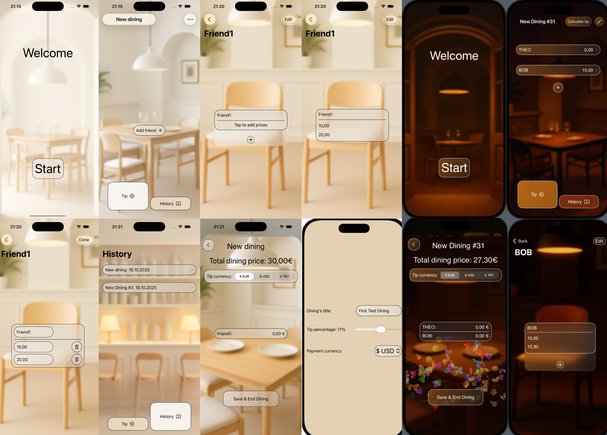
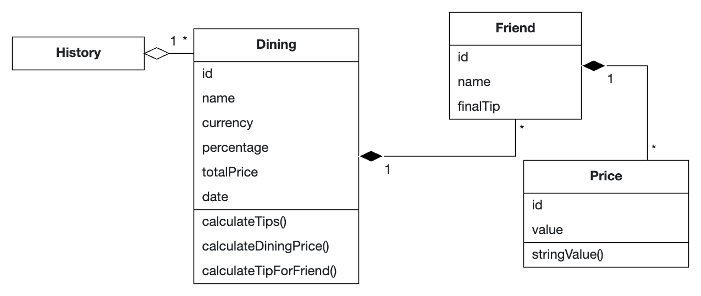
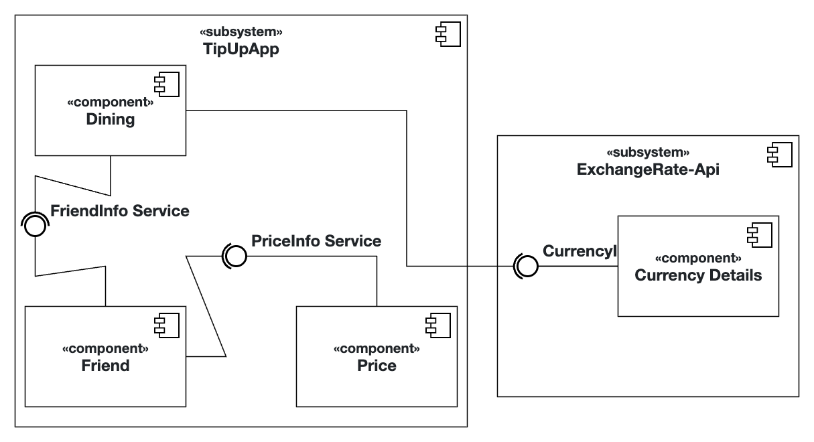

# TipUp iOS-App

## Project Documentation

### Problem Statement

People often spend time together in restaurants. 
When it is time to tip, calculating how much each person should contribute as a tip can be confusing. 
Calculating the fair tip for each individual based on their order can often lead to disagreements or mistakes. 
Therefore people need an app, that can calculate and distribute tips easily and fairly among a group, so that everyone can tip proportional to the amount they paid for their food.

### Requirements

#### Functional Requirements (User Stories)
- As a restaurant customer, I want to be able to calculate the correct amount of money that every person from my group should tip, so that we can give a reasonable tip.
- As a restaurant customer, I want to be able to manage a list of my friends, so that I can use my app with any group of friends.
- As a restaurant customer, I want to save the price each person from my group will pay for their food, so that I will be able to calculate a fair tip for each of them
- As a restaurant customer, I want to choose the percentage of tip so that I can control how much each from the group will pay.
- As a restaurant customer, I want to get access to my previous dinings.
- As a restaurant customer, I want to be able to calculate the tip in different currencies so that I can tip with different currencies.

#### Quality Attributes & External Constraints
* **HIG usability:** Based on Apple HIG and suggestions of my Tutor I implemented all main screens of TipUp App. Mainly I followed the layout, icons and color guidelines.*

* **dark mode:** TipUp contains special colors and background for dart theme. Everything can be found in assets file.*

* **responsiveness:** TipUp uses GeometryReader, which means, that UI will look similar at all iOS devices.* 

* **persistance:** TipUp works with Swift data and works with dinings in which all parameters can be changed and stored.*

* **logging:** TipUp uses logger to show info about results of api calls and debug some actions in ui.*

* **error handling:** App handles all possible errors (which can occure only via API call).*

* **Responsible AI usage:** During the development AI was used as a generative model to generate the app icon and all backgrounds. Also it was used as learning tool, which helped to understand some SwiftUI topics. Also I followed the feedback of AI assistant at GitLab.*

* **Other attributes / constraints:** Strict deadlines. Due to strict deadlines an MVP was developed, but there can be also some features to implement in future, such as sharing of dinings with friends, or choice of every possible currency instead of three hardcoded

#### Glossary (Abbott’s Technique)
| Terms    | Definition      |
| ------------- | ------------- |
| Tip | Correctly calculated number to tip for every person |
| Price | Amount of money for the food item, that a person ate |
| Friend | An individual that participates in dining, has his name, list of prices that he ate and final tip |
| Friend list | A list, where friends can be added and removed |
| Dining | Class which contains friends, their final tips and currency |

#### Analysis Object Model
 
 

#### Subsystem Decomposition

* Subsystem TipUpApp — UI and business logic of App. Managing (Add, remove and change of members of list) of list of dinings, lists of friend and lists of their prices.
* Subsystem ExchangeRate-Api - ApiCaller and third party ExchangeRate API — provides information about actual currencies relationships.

### Developed by Viktor Lynok & Mikhail Khinevich
